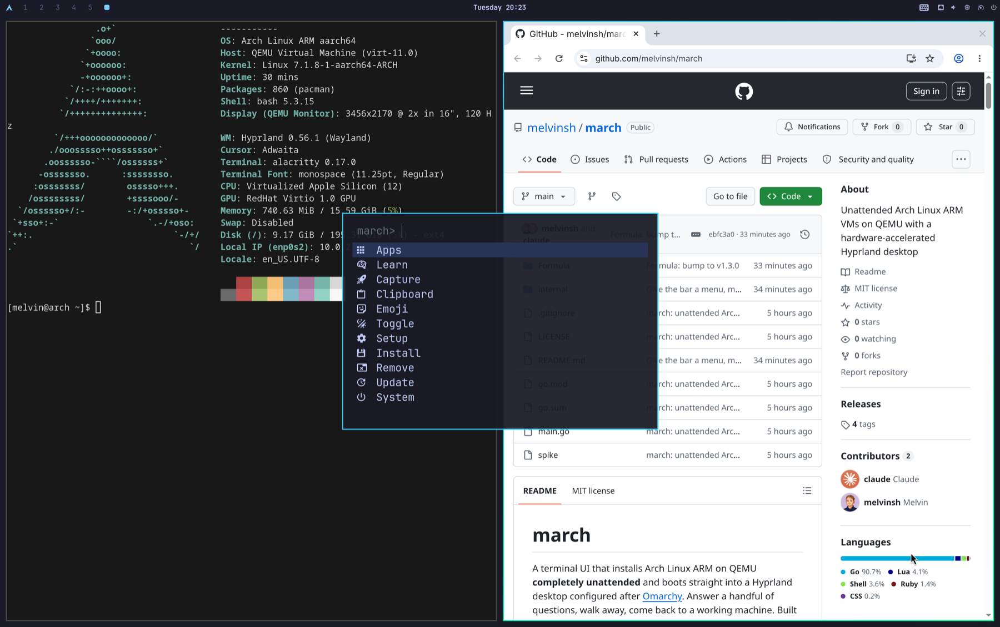
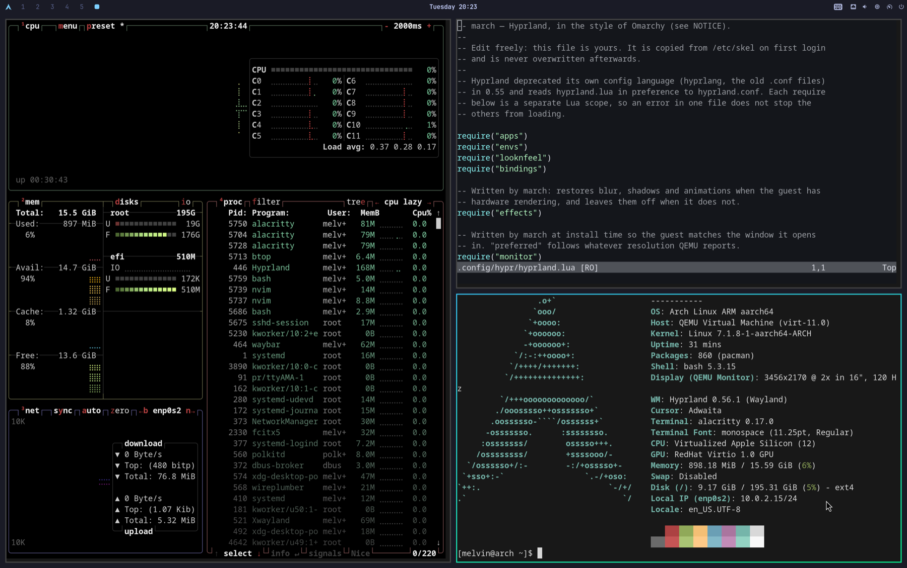
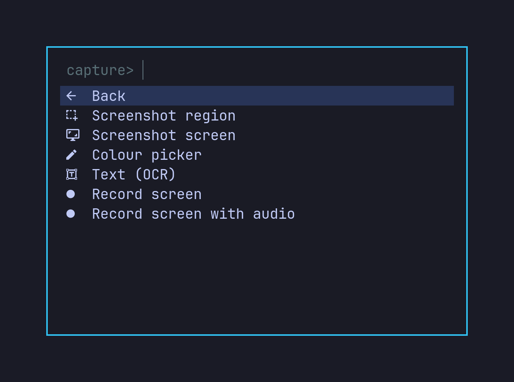

<div align="center">

# march

**Arch Linux ARM VMs on QEMU that install themselves and land in a
hardware-accelerated Hyprland desktop.**

Answer three questions, walk away, come back to a working machine.

[](https://github.com/melvinsh/march/releases)
[](LICENSE)
[](#install)
[](#install)



</div>

## What it is

A terminal UI, built with [Charm](https://github.com/charmbracelet)'s Bubble Tea
v2, that creates a VM, installs Arch Linux ARM into it **completely
unattended**, and boots it into a tiling desktop with the user already logged
in. Under five minutes from `n` to a desktop on a fast connection.

- **Unattended, not scripted-by-you.** No kickstart, no preseed, no ISO
  repacking — march drives Archboot's own `autorun=` hook over the serial
  console.
- **On the GPU.** A bundled patched QEMU gives guests `virtio-gpu-gl`, so Mesa
  in the guest renders through virgl onto the host GPU: `virgl (Apple M5 Pro)`.
- **One desktop, finished.** Hyprland, Waybar, a menu that does something,
  Chrome, and a full toolset, rather than a bare Arch install with a compositor
  on top.

## Install

On macOS this brings the whole stack — march itself and the patched QEMU:

```sh
brew trust melvinsh/march
brew install melvinsh/march/march
march
```

The `brew trust` line is not optional. Homebrew refuses to load formulae from
untrusted third-party taps, and march's QEMU lives in the same tap — so without
it the install stops partway with *"Refusing to load formula
melvinsh/march/qemu-march from untrusted tap"*. Trusting the tap covers both
formulae; it also taps the repository, so no separate `brew tap` is needed.

The GPU stack comes from the `startergo` taps, which Homebrew adds
automatically as dependencies. If it reports those as untrusted too:

```sh
brew trust startergo/angle startergo/libepoxy startergo/virglrenderer
```

Or build it yourself, bringing your own QEMU. aarch64 support and UEFI firmware
are the only requirements:

```sh
go install github.com/melvinsh/march@latest
```

| Platform | Packages |
| --- | --- |
| macOS | `brew install qemu` (software rendering; see [Hardware acceleration](#hardware-acceleration)) |
| Debian/Ubuntu | `apt install qemu-system-arm qemu-utils qemu-efi-aarch64` |
| Arch | `pacman -S qemu-system-aarch64 edk2-aarch64` |
| Fedora | `dnf install qemu-system-aarch64 edk2-aarch64` |

On startup march probes your QEMU build and reports anything missing rather
than failing later with a raw QEMU error.

## Usage


Creating a VM asks for a name, username and password, then does everything else
on its own: downloads the installer, allocates a sparse qcow2 disk, partitions
it, installs the base system and desktop, configures the account, installs the
bootloader, and boots into the desktop with the user already logged in.

| Key | Action |
| --- | --- |
| `n` | Create and install a VM (guided wizard) |
| `↵` | Show VM details |
| `y` | Show the exact QEMU command line |
| `s` / `x` | Start / shut down |
| `r` | Restart |
| `d` | Delete (asks first) |
| `c` | Print the serial-console command |
| `R` | Refresh |
| `?` | Full help |
| `q` | Quit — running VMs keep running |

Reach a running guest with `ssh -p <port> <user>@127.0.0.1` (the port is in the
list), or attach to its serial console with the command `c` prints.

The install announces each phase on the serial console, so march shows real
progress and stops with a useful error rather than a timeout:

```
✓ Preparing the installer
✓ Partitioning the disk
✓ Installing the base system
⣾ Installing the desktop
· Configuring the system
· Installing the bootloader
```

## The desktop

There is one, and it is not a choice: **Hyprland on SDDM**, with a bar, a menu,
a browser and a toolset already configured when you first see it. Keeping it to
one means autologin, scaling, window sizing and every tool in the list have a
single implementation, and the end-to-end suite exercises that one. The desktop
is the product.

Its look and its keymap follow
[Omarchy](https://github.com/basecamp/omarchy), whose Hyprland configuration is
the closest thing to a reference for this shape of desktop. march is not a port
of it: the configuration is march's own, written for hardware that is virtual
and for packages that exist on aarch64.



| | |
| --- | --- |
| Compositor | Hyprland, with blur, shadows and animations |
| Bar | Waybar: workspaces, clock, tray, audio, network, updates, power |
| Menu | `march-menu` on `SUPER + ALT + SPACE` and the bar's Arch button |
| Launcher | fuzzel on `SUPER + SPACE` |
| Notifications | mako, `SUPER + ,` to dismiss |
| Lock | hyprlock |
| Terminal | Alacritty on `SUPER + RETURN` |
| Browser | Google Chrome on `SUPER + SHIFT + RETURN` |
| Keys | `SUPER + K` lists every binding; `SUPER + ESCAPE` opens the System branch |

The keymap splits on the modifier. Applications sit on `SUPER + SHIFT`: browser,
files, editor, the web apps. Windows sit on plain `SUPER`, where `SUPER + T`
floats, `SUPER + F` fills the screen and `SUPER + W` closes. Copy and paste are
`SUPER + C` and `SUPER + V` in every application, terminal included.

Every binding runs a program the install provides, and a test enforces it, so
no shortcut silently does nothing. The keys left unbound are listed with a
reason each at the bottom of
[`bindings.lua`](internal/install/assets/hyprland/bindings.lua); they are the
ones a virtual machine has no answer for, like screen brightness, the keyboard
backlight, the lid switch and the battery.

The configuration is written in **Lua**, not hyprlang, because Hyprland
deprecated its own config language in 0.55. It lands in `/etc/skel`, so it is
copied into the account at creation and is yours to edit; provenance and the
full list of changes are in
[`internal/install/assets/hyprland/NOTICE`](internal/install/assets/hyprland/NOTICE).

### The menu



`march-menu` is a tree of actions covering capture, clipboard, toggles, config
editing, package management and power, rendered through fuzzel. Every branch is
also a route you can open directly, so `march-menu capture` from a script or a
key lands where the bar's Arch button would take you. Its route names and the
shape of the tree follow [Omarchy](https://github.com/basecamp/omarchy)'s menu;
the implementation is plain bash, since that project's Quickshell front end has
no aarch64 build.

| Branch | What is in it |
| --- | --- |
| Apps | the launcher |
| Learn | the key bindings, and the Hyprland, Arch and Bash references |
| Capture | screenshots, annotation, colour picker, OCR, screen recording |
| Clipboard | history, via cliphist |
| Emoji | rofimoji, typed into the focused window |
| Toggle | notification silencing, the bar, window gaps, workspace layout, window transparency, square aspect, display scaling |
| Setup | every config file the desktop reads, in `$EDITOR` |
| Install / Remove | a package picker over pacman, and orphan cleanup |
| Update | system packages, cache cleaning, `fastfetch` |
| System | lock, log out, reboot, shut down |

`SUPER + CTRL + C` opens Capture directly, `SUPER + CTRL + O` the toggles,
`SUPER + CTRL + V` the clipboard and `SUPER + CTRL + E` the emoji picker.

Two things a laptop menu would offer are absent on purpose. There is no
**Suspend**: the guest can enter it, since `/sys/power/state` lists `mem`, but
only a QMP `system_wakeup` brings the machine back and nothing in march's window
or QEMU's sends one, so the entry would strand the VM. There is also no idle
daemon. A guest window sits inside a host that already locks itself, so
`hypridle` is left out rather than configured.

Screen recording encodes on the CPU with `wf-recorder`, because virtio-gpu
exposes no hardware encoder for anything faster to use.

### The bar

Alongside the usual readouts the bar carries an indicator each for pending
updates, do-not-disturb and an active recording, plus a power button. Each stays
empty until it has something to say. Clicking network opens `nmtui`, audio opens
`wiremix`, and the CPU and memory readouts open `btop`, each in a floating
terminal.

### The browser

The browser is **Google Chrome**, and it is the one thing march installs that
does not come from an Arch mirror. Google began shipping Linux builds for
aarch64 in 2026, as `.deb` and `.rpm` only; no Arch package carries an aarch64
build and march installs no AUR helper. So the install fetches Google's own
`.deb` and unpacks it, which is what a PKGBUILD would do anyway.

Two consequences worth stating plainly. Google's CDN is now a dependency of
every install — if it is unreachable, the install fails rather than quietly
falling back. And updates do not come from `pacman`: the cron job Google's
package ships to add an apt repository is deliberately left out, since a machine
with no apt would run it daily to no effect.

Chrome is the default browser three ways over: the desktop entry in
`mimeapps.list` for anything that asks `xdg-mime`, `$BROWSER` for anything that
does not, and `apps.lua`, which is the one place the desktop names its browser —
the keys and the menu both read it from there. Because Chrome still picks X11
unless told otherwise, every launch march controls passes
`--ozone-platform=wayland`.

Its WebGL is the one thing in the guest that is *not* accelerated —
[why](docs/GRAPHICS.md#chrome-is-the-exception).

### The toolset

A guest is a working machine on first boot rather than a bare Arch install:
`git`, `neovim`, `lazygit`, `ripgrep`, `fd`, `fzf`, `bat`, `eza`, `zoxide`,
`starship`, `tmux`, `docker` (with the account already in the group), `mpv`,
`imv`, `evince`, LibreOffice, GNOME Disks, and the rest of the list in
`internal/install/standard.go`.

**Nothing is installed that this hardware cannot run.** A package whose device
does not exist is a command that fails, a daemon that idles, and download time
paid on every install. So a desktop machine's kit stops at the hardware line:
no `bluez` (no controller), no `ddcutil` (no DDC channel), no
`power-profiles-daemon` (no battery), no `wireless-regdb` (no radio), no
`gpu-screen-recorder` (no hardware encoder), no `hyprsunset` (no DRM gamma
ramp). Each omission carries its reason in `omittedForVirtualHardware`, and a
test fails if one of them creeps back in. `linux-firmware` goes for the same
reason: 277 MB of vendor blobs for hardware that is not there.

Printing works the one way it can from behind user-mode networking: CUPS with
`cups-pdf`, so Print always has somewhere to go. Sound is an Intel HDA card
and a full PipeWire stack, so the volume keys do something.

## Hardware acceleration

Stock QEMU on macOS has no OpenGL at all, so guests render on the CPU through
llvmpipe. march ships its own QEMU that fixes this, installed alongside your
existing one and preferred automatically when present:

```
OpenGL core profile renderer: virgl (Apple M5 Pro)
```

Two things follow. The desktop turns its blur, shadows and animations on, which
software rendering leaves off, and the guest reports `+virgl` at the kernel
level. `brew install melvinsh/march/march` pulls the QEMU in already; nothing
breaks if you skip it.

The hard part is that Homebrew's QEMU is built without OpenGL, the community
taps that add it omit `libslirp` so their guests have no network, and both take
the name `qemu`. There is also a ceiling — GLES 3.0, a browser on SwiftShader,
and a Venus path that cannot work on Apple Silicon.
[docs/GRAPHICS.md](docs/GRAPHICS.md) has all of it, including the seven
benign `ERR` lines every guest logs and why none of them is a fault.

## How it works

Arch has no kickstart and Archboot's installer is interactive, but Archboot
honours an `autorun=<url>` kernel parameter and its GRUB menu exposes a command
line over the serial console. So march starts a throwaway HTTP server bound to
loopback, boots the ISO, drives GRUB to boot with its own kernel command line,
and the guest installs itself. Nothing is patched and no ISO is repacked.

[docs/DESIGN.md](docs/DESIGN.md) covers the rest: why Archboot, what the
QEMU command line is tuned for and why, how the window is sized and scaled, and
where everything lands on disk. The account password is never written to disk.

## Development

```sh
go test ./...              # includes tests that run real QEMU
go test -short ./...       # unit tests only, no QEMU or network
go test -race ./...

MARCH_E2E=1 go test ./internal/vm/ -run TestUnattendedDesktopInstall -timeout 60m
MARCH_E2E=1 go test ./internal/vm/ -run TestHardwareAcceleratedDesktop -timeout 60m
```

The test suite builds command lines and then hands them to the real
`qemu-system-aarch64` to confirm it accepts every option, device and internal
reference, and boots an actual VM to exercise the QMP, pidfile and shutdown
paths. It also parses the live Archboot index, so a change to their filename
scheme surfaces as a test failure rather than a broken install.

The hardware-acceleration test is the one that cannot be faked: a
software-rendered desktop looks identical from outside, just slower, so the
test asks Mesa inside the guest what it is actually drawing with and fails if
it sees `llvmpipe`.

It does not stop there. `internal/vm/testdata/guest-selftest.sh` is fetched by
the guest over the same loopback HTTP path the installer came from and run
inside the live session, so the desktop is tested by using it: every
application is launched and waited for until it maps a window, every menu route
is opened, every toggle is flipped and read back, every button in the bar is
clicked, every key is read out of the running compositor, a screenshot is taken
and OCR'd, a recording is made and played back, and a tone is pushed through
the sink. The picker and the region selector are answered by stand-ins on
`PATH`, so the code behind them runs for real. Each check prints one line, and
the Go test turns each one into a result.

```sh
MARCH_E2E=1 MARCH_E2E_KEEP=1 go test ./internal/vm/ -run TestUnattendedDesktopInstall -v
MARCH_E2E_RERUN=1 go test ./internal/vm/ -run TestGuestSelftest -v   # against the kept VM
```

The first leaves the machine running; the second re-runs the in-guest suite
against it, which is the way to iterate on the suite without paying for another
install.

The pictures in this README are made the same way: `docs/capture.sh` drives a
running guest's own compositor over ssh and captures with `grim`, and
`docs/tapes/` records the TUI with [VHS](https://github.com/charmbracelet/vhs).
Both are re-run rather than reproduced by hand.
